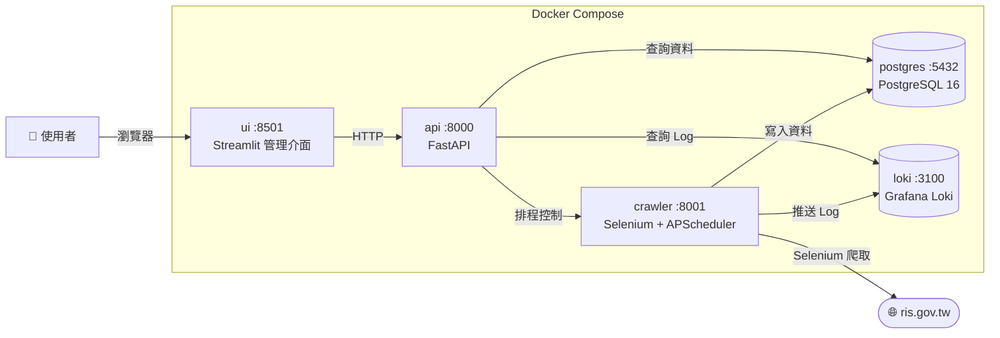

# 台北市門牌編釘資料爬蟲系統

爬取 [ris.gov.tw](https://www.ris.gov.tw/app/portal/3053) 的門牌編釘異動資料，提供查詢介面、排程管理、Log 收集與異常通知。

## 系統架構



## 專案結構

```
.
├── 試題1/          ← 爬蟲（crawler.py、Dockerfile、requirements.txt）
├── 試題2/          ← API + UI（api.py、ui.py、Dockerfile、Dockerfile.ui）
├── 試題3/          ← 共用 Log 模組（log_utils.py）
├── docker-compose.yml
├── .env.example    ← 環境變數範本（複製為 .env 後填入）
└── data/           ← 執行時自動建立（log、資料庫 volume）
```

## 快速開始

### 1. 複製環境變數範本

```bash
cp .env.example .env
```

接著編輯 `.env`，至少填入 `POSTGRES_PASSWORD`（見下方說明）。

### 2. 啟動服務

```bash
# 背景啟動所有服務
docker compose up -d

# 同時重新建置 image（程式碼有變動時使用）
docker compose up -d --build
```

### 3. 確認服務狀態

```bash
docker compose ps
```

各服務健康檢查通過後（約 30–60 秒），即可存取：

| 服務 | 位址 |
|------|------|
| Streamlit 管理介面 | http://localhost:8501 |
| API | http://localhost:8000 |

### 4. 查看 Log

```bash
# 追蹤所有服務 log
docker compose logs -f

# 只看特定服務
docker compose logs -f crawler
docker compose logs -f api
```

### 5. 停止服務

```bash
# 停止並移除容器（資料保留在 ./data/）
docker compose down

# 停止並同時移除 volume
docker compose down -v
```

### 6. 完整清除（重建環境）

```bash
# 移除容器、image、volume
docker compose down -v --rmi all
```

---

## 環境變數說明

複製 `.env.example` 為 `.env` 後依需求調整。

### 建議調整

| 變數 | 說明 | 範例 |
|------|------|------|
| `POSTGRES_PASSWORD` | 資料庫密碼（必填）| `mySecurePass123` |
| `DATE_START` | 爬取起始日期（民國年） | `114-01-01` |
| `DATE_END` | 爬取結束日期（民國年） | `114-12-31` |
| `QUERY_TYPE` | 查詢類型 | `門牌初編` / `門牌改編` / `門牌廢止`.... |
| `MAX_RETRY` | 驗證碼辨識失敗最大重試次數 | `10` |
| `SMTP_USER` | Gmail 帳號 | `yourname@gmail.com` |
| `SMTP_PASSWORD` | Gmail 應用程式密碼（見下方） | `xxxx xxxx xxxx xxxx` |
| `NOTIFY_EMAIL` | 接收異常通知的信箱 | `admin@example.com` |
| `NOTIFY_COOLDOWN` | 通知冷卻時間（秒），防止頻繁發信 | `300` |

### 不建議異動

| 變數 | 說明 |
|------|------|
| `RUNNING_IN_DOCKER` | 容器內固定為 `true` |
| `POSTGRES_HOST` | 服務名稱，與 docker-compose 內部網路對應 |
| `LOKI_URL` | 同上 |
| `CRAWLER_URL` | 同上 |
| `SMTP_HOST` / `SMTP_PORT` | Gmail SMTP 固定設定，使用其他信箱服務才需更改 |

---

## 資料庫密碼設定

在 `.env` 中設定 `POSTGRES_PASSWORD`，可使用任意字串（建議 12 字元以上，避免特殊符號 `@` `#`）：

```env
POSTGRES_PASSWORD=mySecurePass123
```

**注意**：`.env` 已列入 `.gitignore`，密碼不會上傳至 Git。首次 `docker compose up` 後密碼即寫入資料庫 volume；之後若想更改密碼，需先執行 `docker compose down -v` 清除 volume 再重啟。

---

## Gmail 應用程式密碼取得方式

1. 登入 Google 帳號 → 前往 [myaccount.google.com/security](https://myaccount.google.com/security)
2. 確認「兩步驟驗證」已開啟（必要條件）
3. 搜尋「應用程式密碼」→ 點選進入
4. 應用程式名稱輸入任意名稱（例如 `crawler`）→ 點選「建立」
5. 複製產生的 16 字元密碼（格式：`xxxx xxxx xxxx xxxx`）
6. 填入 `.env`：

```env
SMTP_HOST=smtp.gmail.com
SMTP_PORT=587
SMTP_USER=yourname@gmail.com
SMTP_PASSWORD=xxxx xxxx xxxx xxxx
NOTIFY_EMAIL=receiver@example.com
```

異常通知會在爬蟲服務出現 `ERROR` 等級 log 時自動發送，冷卻期內（預設 5 分鐘）只發一封。

---

## 執行畫面
### 排程執行/管理頁面


### 爬蟲查詢頁面


**可參考輸出csv範例檔案.csv**
  
## log 查詢頁面


---

## 注意事項

- 排程設定**不持久化**：crawler 容器重啟後排程狀態消失，需透過 UI 或 API 重新設定。
- 資料存放於 `./data/`。
- 首次啟動需等待 postgres 與 loki 健康檢查通過，crawler 才會啟動（約 30–60 秒）。
