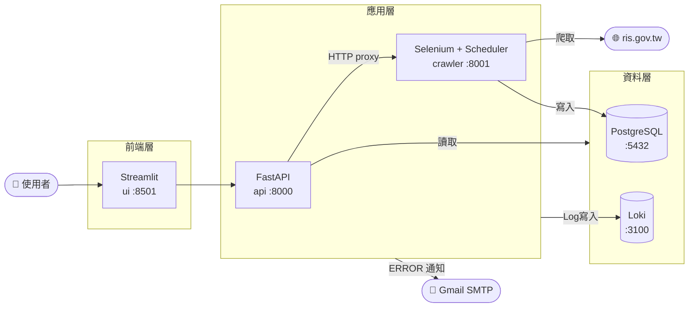

# 試題4 — 系統架構圖

## 整體架構



---

## 服務啟動順序（依賴鏈）

```
postgres  ──healthcheck──┐
                          ├──► crawler ──healthcheck──► api ──► ui
loki      ──healthcheck──┘
```

`docker-compose.yml` 使用 `condition: service_healthy` 確保：
- `crawler` 在 postgres 與 loki 都健康後才啟動
- `api` 在 crawler 也健康後才啟動（避免排程代理在 crawler 未就緒時收到請求）
- `ui` 最後啟動，依賴 api

---

## 各服務職責

| 服務 | Port | 職責 |
|------|------|------|
| **postgres** | 5432 | 持久化儲存爬取的門牌資料（`scraped_items` 資料表） |
| **loki** | 3100 | 接收 crawler / api 推送的 log，提供歷史查詢 |
| **crawler** | 8001 | Selenium 爬蟲 + APScheduler 排程 + FastAPI 控制端點 |
| **api** | 8000 | 資料查詢、排程控制 proxy、Log 查詢、Email 異常通知 |
| **ui** | 8501 | Streamlit 介面，整合所有功能供使用者操作 |

---

## 關鍵設計決策

### 1. 爬蟲與 API 分離（試題1 / 試題2 解耦）

Crawler 獨立為一個服務，對外只暴露 `/run`、`/set`、`/stop`、`/status`、`/health`。  
API 透過 HTTP proxy 控制排程，不直接持有 scheduler 物件。  
好處：crawler 重啟不影響 api 服務的查詢功能，也方便未來水平擴展爬蟲實例。

### 2. PostgreSQL 取代 SQLite

Docker 環境下多服務共享資料庫時，SQLite 的檔案鎖會造成並發寫入問題。  
PostgreSQL 支援多連線、ACID 交易，也方便未來加入讀寫分離或 replica。

### 3. Loki fail-safe 設計

Crawler 與 API 連接 Loki 時若失敗，只印 WARNING 並繼續執行，不中斷主程式。  
Log 同時寫入本地檔案（`data/crawler.log`、`data/api.log`）作為備援。

### 4. 異常通知冷卻機制

API 發送 Email 通知時加入 `NOTIFY_COOLDOWN`（預設 300 秒），  
避免爬蟲連續失敗時造成信件洪泛，也保護 SMTP 服務不被封鎖。

### 5. Volume bind mount 保留資料

postgres 與 loki 資料目錄 mount 至 `./data/`，  
`docker compose down` 後資料不遺失，`docker compose down -v` 才會清除。
